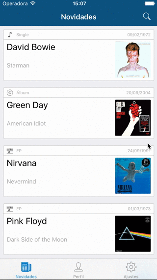
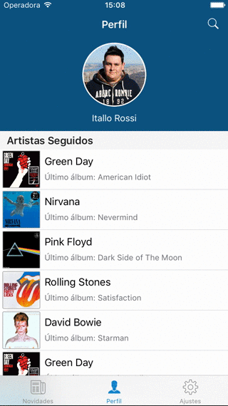
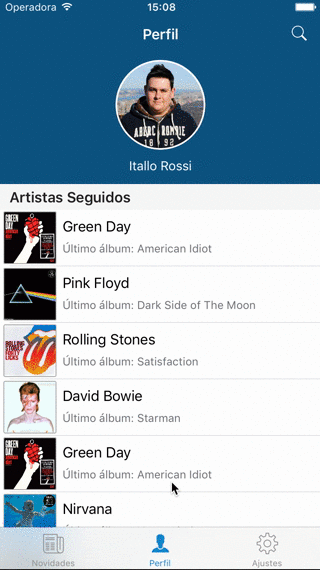
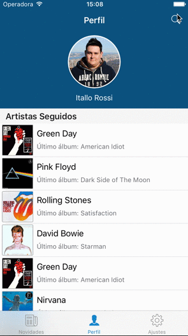

# AlbumTrackr-iOS

AlbumTrackr is a project that has the main objective of creating the UI of a possible app that will provide music fans the latest updates about the artists that they like.

This project also has an ongoing, like this one, Android version and can be found at:

 - [AlbumTrackr-Android](https://github.com/leoassuncao/albumtracker)

## Showcase

<p align="center">




</p>

## Features and General Characteristics

### News Feed

```
STATUS: ONGOING
```

This screen will hold all the updates from the followed artists. The news that appear in the feed will be also pushed to the users. The updates will have 4 main types:

 - Single
 - EP
 - Album
 - Other

This screen is also inteded to support social networking features like posts, liking and/or comments.

### Profile

```
STATUS: ONGOING
```

This screen will store the user image, its name and also its nickname. In a list, below the profile summary, will be stored the artists followed by the user. If the user wants it will be able to see the artist discography by clicking in the list, the user will also be able to unfollow an artist.

### Settings

```
STATUS: ONGOING
```

This screen will hold all settings that will be provided to the user. They'll be related to managing the account, notifications and help.

### Search and Artist Addition

```
STATUS: ONGOING
```

This screen will make possible for the user to look for its favorites artists and consequently adding them to its followed artists list. Once you start following an artist you will start receiving its updates and will also be able to see its discography.

### Localization

```
STATUS: ONGOING
```

Currently the appliaction is being localized in the following languages:

 - English (US)
 - Portuguese (BR)

## Known issues

 - [SOLVED] ~~In the Profile view when you unfollow an artist the cells that are not appearing in the screen,at the moment, have an weird behavior~~ [SOLUTION] The image was missing a constraint to the cell, the constraint was connected to the content view
 - [SOLVED] ~~In the Artist view, after you choose an artist form the Profile view, the back button is showing the name of the previous view, but should not be likes this~~ [SOLUTION] Remove the username from the navigattion controller so it would behavior normally

## Next steps

 - Finish implementing the UI features
 - Build the backend services
 - Connect UI to backend
 - Write unit tests
 - Write UI tests

## Special Thanks

 - [Icons8](https://icons8.com/) for providing free great icons!

## License

Itallo Rossi Barcelos Lucas is a Software Engineer that works with iOS, Ruby on Rails and Java.

Copyright (C) 2016 Itallo Rossi Barcelos Lucas

This program is free software: you can redistribute it and/or modify
it under the terms of the GNU Affero General Public License as published
by the Free Software Foundation, either version 3 of the License, or
(at your option) any later version.

This program is distributed in the hope that it will be useful,
but WITHOUT ANY WARRANTY; without even the implied warranty of
MERCHANTABILITY or FITNESS FOR A PARTICULAR PURPOSE.  See the
GNU Affero General Public License for more details.

You should have received a copy of the GNU Affero General Public License
along with this program.  If not, see <http://www.gnu.org/licenses/>.